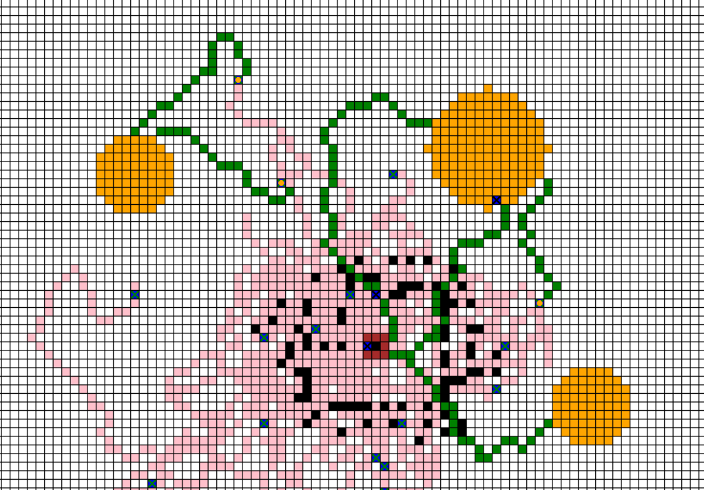

# ant-colony-optimization

## preamble / préambule

This is the source for a project (TIPE) that I had to do in CPGE in France. Keep in mind that the code was not intended to be used by any other person than me, and the final goal was to make a presentation in French.\
I'm currently trying to comment the code and write a report in English, so everyone can understand what I did in this project.\
If you need any explanation, whether you're looking at this code to copy it, understand it or to recruit me, please feel free to contact me on github, by mail at alex.dang2803@gmail.com or on linkedin https://www.linkedin.com/in/alexandre-dang-771547195/.\

Ceci est le code source d'un projet (TIPE) que j'ai fait en prépa (CPGE) en France. Gardez à l'esprit que ce code n'a été écrit que pour être utilisé par moi seul, et que le but final était de présenter le projet en français.\
J'essaie actuellemtn de commenter le code et d'écrire un rapport en anglais de sorte que tout le monde puisse comprendre ce que j'ai fait sur ce projet.\
Si vous avez besoin d'explications sur ce code, que vous voulez vous en inspirer, le comprendre ou me recruter, vous pouvez me contacter sur github, par mail a alex.dang2803@gmail.com ou sur linkedin https://www.linkedin.com/in/alexandre-dang-771547195/.\
\
## How to use / Comment utiliser

I won't go over the debugging functions.\
Je ne vais pas parler des fonctions qui me servent pour le debuggage.\
\
Download everything and open the Fourmis_main_en.py file, execute it and it should open an interface. \
On the left panel :\
 +X steps will make the simulation go for X steps, use it once you spawned some ants and food.\
 The food button allows you to spawn food wherever you click, clicking the button again will stop the spawning of food. The number above is the diameter of the circle of food you spawn.\
 The Launch button will start a simulation of 500 steps and record the score (number of pieces of food brought back to the anthill)\
On the right, you can spawn ants on the anthill. The type of ant is displayed above.\
The go back home button will order your ants to go back to the anthill.\
The last panel is for map editing, you can place/remove walls and save/load maps saved under a .txt file.\
A simple demo would be loading map1.txt and then clicking the launch button.\
 \
Téléchargez tout et ouvrez le fichier Fourmis_main_fr.py et l'exécuter.\
Sur le panel de gauche :\
 +X pas va faire avancer la simulation de X pas, à utiliser une fois qu'il y a des fourmis et de la nourriture.\
 Le bouton nourriture va vous permettre de faire apparaître de la nourriture. Le nombre au-dessus du bouton est le diamètre du cercle de nourriture à faire apparaître.\
 Le bouton lancer va lancer une simulation de 500 pas et enregistrer le score (nombre de morceaux de nourriture rapportés à la fourmilière)\
A droite, vous pouvez faire apparaître des fourmis sur la fourmilière, le type de fourmis est affiché au dessus.\
Le bouton Rentre à la maison va faire revenir toutes les fourmis à la fourmilière.\
Le dernier panel est pour éditer la carte, vous pouvez placer/enlever des murs et charger/sauvegarder la carte dans un fichier .txt.\
Une démonstration simple serait de charger la map 1.txt et de lancer la simulation.\
